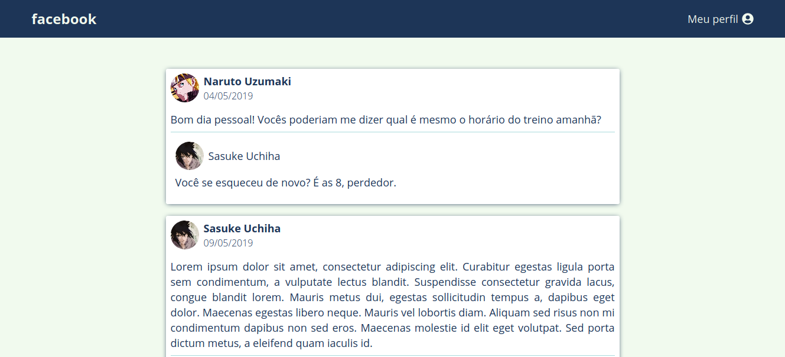
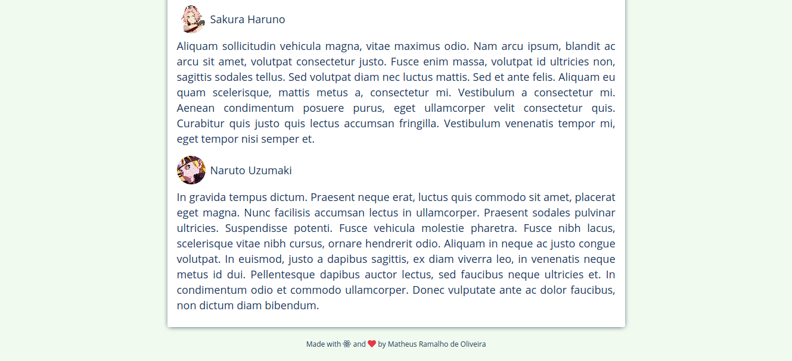

## GoStack Bootcamp Challenge 4
> 🚀 Practical project of the [Rocketseat](https://rocketseat.com.br) GoStack Bootcamp.  
👷 Developed by Matheus Ramalho de Oliveira.  
🔨 Systems Analyst, Full-Stack Developer.  
🏡 Goiânia, Goiás, Brasil.  
✉️ kastorcode@gmail.com  
👍 [instagram.com/kastorcode](https://www.instagram.com/kastorcode)

---

### Screenshots

<p align="center">
  
</p>
<p align="center">
  
</p>

---

<p align="center">
  
</p>
<p align="center">
    Challenge 4: Introduction to React
</p>

---

## :rocket: Sobre o desafio

Crie uma aplicação do zero utilizando **Webpack, Babel, Webpack Dev Server e ReactJS**.

Nessa aplicação você irá desenvolver uma **interface** semelhante com a do **Facebook** utilizando React.

As informações contidas na interface são **estáticas** e não precisam refletir nenhuma API REST ou back-end.

### Tela da aplicação


O layout não precisa ficar exatamente igual, você pode utilizar sua criatividade para modificar da maneira que preferir.

O mais importante é que todos elementos apareçam em tela.

O layout da aplicação está [nesse link](.github/layout.sketch) que pode ser aberto por essa ferramenta gratuita e online: https://www.figma.com/

### Componentes

Na imagem abaixo destaquei cada componente que você criará e abaixo da imagem está a descrição e responsabilidades de cada um:


**Header (Amarelo):** Responsável por exibir a logo e o link para acessar o perfil;

**PostList (Verde):** Responsável por armazenar os dados da listagem de post, esses dados devem ficar dentro do `state` do componente e não em uma variável comum, por exemplo:

```js
class PostList extends Component {
  state = {
    posts: [
      {
        id: 1,
        author: {
          name: "Julio Alcantara",
          avatar: "http://url-da-imagem.com/imagem.jpg"
        },
        date: "04 Jun 2019",
        content: "Pessoal, alguém sabe se a Rocketseat está contratando?",
        comments: [
          {
            id: 1,
            author: {
              name: "Diego Fernandes",
              avatar: "http://url-da-imagem.com/imagem.jpg"
            },
            content: "Conteúdo do comentário"
          }
        ]
      },
      {
        id: 2
        // Restante dos dados de um novo post
      }
    ]
  };
}
```

**Post (Vermelho):** Responsável por exibir os dados do post, esses dados devem vir através de uma propriedade recebida do componente PostList, ou seja, lá no PostList você terá algo assim:

```js
posts.map(post => <Post key={post.id} data={post} />);
```

**Comment (Azul):** Responsável por exibir um comentário. Os dados do comentário virão por uma propriedade do componente. Dentro do componente Post você terá um novo `.map` para listar os comentários do post:

```js
data.comments.map(comment => <Comment key={comment.id} data={comment} />);
```

---

### 🗓 ️Roadmap
- Introduction to Node.js
- Creating Node.js project
- Continuing Node.js project
- CSS Flexbox
- UI Design
- Introduction to React
- First project with ReactJS
- First project with React Native
- Front-end documentation
- Flux architecture
- Using React Hooks
- Server-side rendering(SSR) with ReactJS
- GraphQL
- Expo
- Creating ReactJS project
- Creating React Native project
- Animations with React Native
- Full-stack app development
- Node.js tests
- Node.js deploy
- ReactJS tests
- React Native tests
- ReactJS deploy
- React Native publication
- WebSocket with Express
- Advanced patterns at Node.js
- OmniStack SaaS(software as a service) and AdonisJS
- Final challenge
- Monorepo
